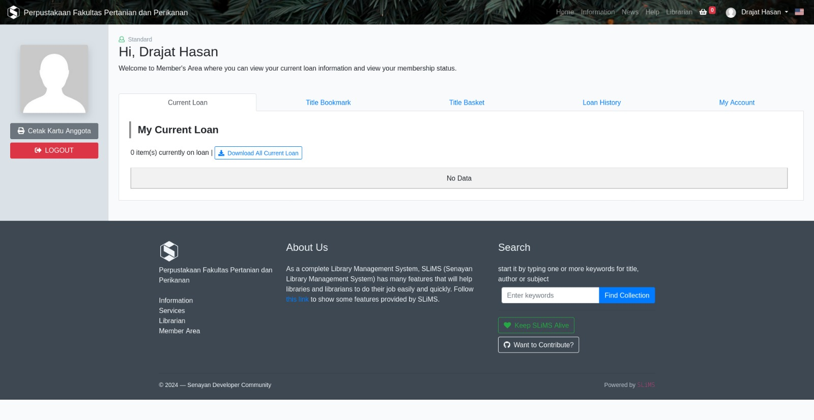
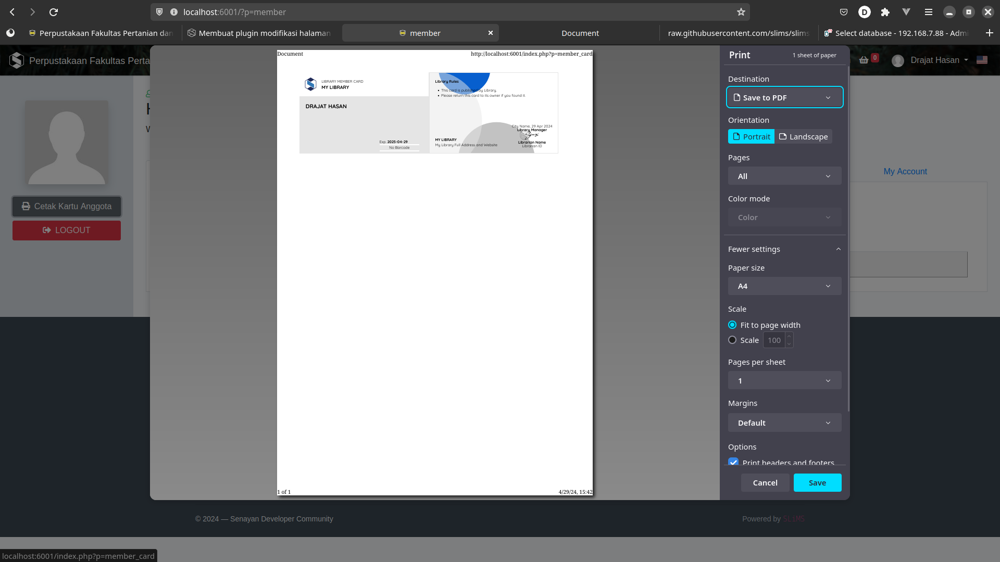

# Plugim Membcard di OPAC
## Cara memasang
1. Unduh versi rilis nya pada [halaman ini](https://github.com/drajathasan/slims-membercard-opac/archive/refs/tags/v1.0.0.zip)
2. Ekstrak plugin yang sudah didownload pada direktori ```plugins/``` yang ada di dalam SLiMS anda.
3. Aktifkan plugin tersebut pada modul sistem (cari plugin tersebut dengan kata kunci membercard)
4. Login ke member area, maka akan muncul tombol cetak kartu anggota di kiri atas.

